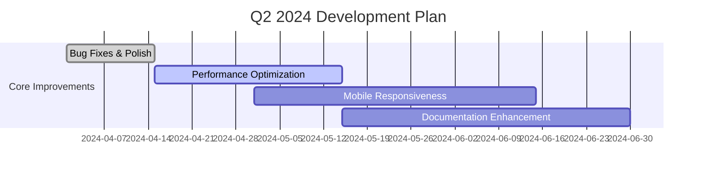
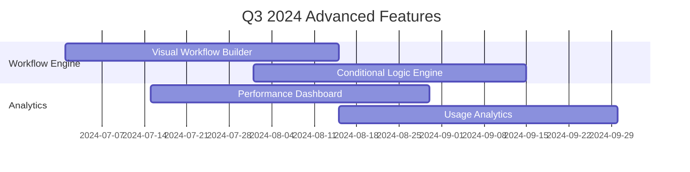
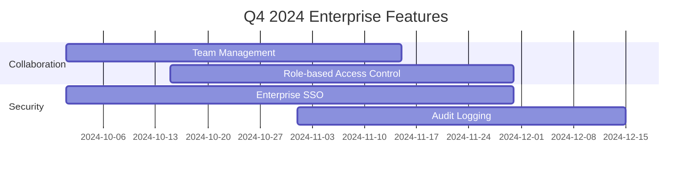

# 🚀 Google ADK No-Code Platform - Development Roadmap

> **Building the future of AI agent development, one feature at a time**

---

## 📊 **Platform Overview**

| **Metric** | **Current Status** | **Target** | **Timeline** |
|------------|-------------------|------------|--------------|
| **Core Features** | ✅ 85% Complete | 🎯 100% | Q2 2024 |
| **User Experience** | 🔄 70% Complete | 🎯 95% | Q3 2024 |
| **Enterprise Features** | 📋 20% Complete | 🎯 80% | Q4 2024 |
| **Advanced AI** | 🚧 40% Complete | 🎯 90% | Q1 2025 |

---

## 🎯 **Current Feature Status**

### **✅ Completed Features**

| **Category** | **Feature** | **Status** | **Completion Date** |
|--------------|-------------|------------|-------------------|
| **Core Platform** | User Authentication | ✅ Complete | Q1 2024 |
| **Core Platform** | Agent Management (CRUD) | ✅ Complete | Q1 2024 |
| **Core Platform** | Tool Management System | ✅ Complete | Q1 2024 |
| **Core Platform** | Basic Chat Interface | ✅ Complete | Q1 2024 |
| **Core Platform** | Project Management | ✅ Complete | Q1 2024 |
| **Core Platform** | Sub-Agent System | ✅ Complete | Q2 2024 |
| **Core Platform** | AI Suggestions | ✅ Complete | Q2 2024 |
| **Integration** | Google ADK Integration | ✅ Complete | Q1 2024 |
| **Integration** | Langfuse Observability | ✅ Complete | Q1 2024 |

### **🔄 In Progress**

| **Category** | **Feature** | **Progress** | **ETA** |
|--------------|-------------|--------------|---------|
| **UI/UX** | Mobile Responsiveness | 🔄 60% | Q2 2024 |
| **Performance** | Caching & Optimization | 🔄 45% | Q2 2024 |
| **Testing** | Automated Test Suite | 🔄 30% | Q3 2024 |

### **📋 Planned Features**

| **Category** | **Feature** | **Priority** | **Target Quarter** |
|--------------|-------------|--------------|-------------------|
| **Workflow** | Visual Workflow Builder | 🔴 High | Q3 2024 |
| **Analytics** | Performance Dashboard | 🔴 High | Q3 2024 |
| **Collaboration** | Team Management | 🟡 Medium | Q4 2024 |
| **Security** | Enterprise SSO | 🟡 Medium | Q4 2024 |

---

## 🗓️ **Development Timeline**

### **Q2 2024 - Foundation Strengthening** 🏗️



**Key Deliverables:**
- 🎯 **Performance Boost**: 40% faster agent execution
- 📱 **Mobile Experience**: Responsive design for all devices
- 📚 **User Guides**: Comprehensive documentation
- 🐛 **Stability**: 99.9% uptime target

---

### **Q3 2024 - Advanced Features** 🚀



**Key Deliverables:**
- 🎨 **Visual Workflow Builder**: Drag-and-drop interface
- 📊 **Analytics Dashboard**: Real-time performance metrics
- 🔄 **Advanced Workflows**: Conditional logic and loops
- 📈 **Business Insights**: ROI and efficiency metrics

---

### **Q4 2024 - Enterprise Ready** 🏢



**Key Deliverables:**
- 👥 **Team Collaboration**: Multi-user development
- 🔐 **Enterprise Security**: SSO and advanced authentication
- 📝 **Audit Trails**: Complete activity logging
- 🎭 **Role Management**: Granular access controls

---

## 🔮 **Future Vision (2025+)**

### **AI Agent Swarms** 🤖
- **Coordinated Multi-Agent Systems**: Agents working together intelligently
- **Emergent Behavior**: Complex behaviors from simple agent interactions
- **Scalable Orchestration**: Manage thousands of agents simultaneously

### **Edge Computing Integration** 💻
- **Local Execution**: Run agents on edge devices
- **Offline Capabilities**: Function without internet connectivity
- **Real-time Processing**: Ultra-low latency responses

### **Advanced AI Capabilities** 🧠
- **Multi-Modal Support**: Text, image, audio, video processing
- **Learning Agents**: Agents that improve over time
- **Predictive Analytics**: Anticipate user needs

---

## 📈 **Success Metrics & KPIs**

### **Technical Metrics**

| **Metric** | **Current** | **Q2 Target** | **Q3 Target** | **Q4 Target** |
|------------|-------------|----------------|---------------|----------------|
| **Agent Response Time** | 2.5s | 1.8s | 1.2s | 0.8s |
| **Platform Uptime** | 98.5% | 99.0% | 99.5% | 99.9% |
| **User Satisfaction** | 4.2/5 | 4.5/5 | 4.7/5 | 4.8/5 |
| **Feature Adoption** | 65% | 75% | 85% | 90% |

### **Business Metrics**

| **Metric** | **Current** | **Target** | **Timeline** |
|------------|-------------|------------|--------------|
| **Active Users** | 150 | 500 | Q3 2024 |
| **Agent Deployments** | 45 | 200 | Q3 2024 |
| **Tool Usage** | 89 | 300 | Q3 2024 |
| **Customer Retention** | 78% | 85% | Q4 2024 |

---

## 🛠️ **Technology Stack Evolution**

### **Current Stack** ✅
```
Frontend: JavaScript ES6+, Tailwind CSS
Backend: FastAPI, Python 3.9+
Database: SQLite
AI Framework: Google ADK
Observability: Langfuse
```

### **Planned Upgrades** 🔄
```
Frontend: React/Vue.js, TypeScript
Backend: FastAPI 2.0+, Python 3.12+
Database: PostgreSQL, Redis
AI Framework: Google ADK 2.0
Observability: Langfuse + Prometheus + Grafana
```

---

## 🎨 **UI/UX Enhancement Plan**

### **Design System** 🎨
- **Component Library**: Reusable UI components
- **Design Tokens**: Consistent spacing, colors, typography
- **Accessibility**: WCAG 2.1 AA compliance
- **Dark Mode**: Theme customization

### **User Experience** ✨
- **Onboarding Flow**: Interactive tutorials
- **Contextual Help**: In-app assistance
- **Keyboard Shortcuts**: Power user features
- **Customizable Layouts**: Personalized dashboards

---

## 🔌 **Integration Roadmap**

### **Phase 1: Core Integrations** 🔴
- [ ] **Google Cloud Platform**: Advanced AI services
- [ ] **Slack/Discord**: Team communication
- [ ] **GitHub/GitLab**: Version control
- [ ] **Jira/Asana**: Project management

### **Phase 2: Business Tools** 🟡
- [ ] **Salesforce**: CRM integration
- [ ] **HubSpot**: Marketing automation
- [ ] **Stripe**: Payment processing
- [ ] **Zapier**: Workflow automation

### **Phase 3: Enterprise Systems** 🟢
- [ ] **Active Directory**: Enterprise authentication
- [ ] **SAML/OAuth**: SSO providers
- [ ] **LDAP**: Directory services
- [ ] **VPN Integration**: Secure access

---

## 🚨 **Risk Assessment & Mitigation**

### **High Risk Items** 🔴

| **Risk** | **Impact** | **Probability** | **Mitigation Strategy** |
|----------|------------|-----------------|-------------------------|
| **Google ADK API Changes** | High | Medium | Maintain API versioning, fallback mechanisms |
| **Performance Bottlenecks** | High | Low | Continuous monitoring, optimization sprints |
| **Security Vulnerabilities** | Critical | Low | Regular security audits, penetration testing |

### **Medium Risk Items** 🟡

| **Risk** | **Impact** | **Probability** | **Mitigation Strategy** |
|----------|------------|-----------------|-------------------------|
| **User Adoption** | Medium | Medium | User research, iterative design |
| **Scalability Issues** | Medium | Low | Load testing, auto-scaling |
| **Third-party Dependencies** | Medium | Medium | Multiple providers, fallback options |

---

## 📚 **Documentation & Training**

### **User Documentation** 📖
- **Getting Started Guide**: Step-by-step tutorials
- **API Reference**: Complete endpoint documentation
- **Best Practices**: Development guidelines
- **Troubleshooting**: Common issues and solutions

### **Developer Resources** 👨‍💻
- **Architecture Guide**: System design documentation
- **Contributing Guidelines**: Development standards
- **Code Examples**: Sample implementations
- **Video Tutorials**: Visual learning resources

---

## 🌟 **Community & Ecosystem**

### **Open Source Contributions** 🤝
- **Plugin System**: Extensible architecture
- **API Ecosystem**: Third-party integrations
- **Community Forums**: User discussions
- **Hackathons**: Innovation events

### **Partnership Opportunities** 🤝
- **AI Research Institutions**: Academic collaboration
- **Technology Partners**: Tool and service providers
- **Industry Experts**: Domain knowledge sharing
- **Developer Advocates**: Community building

---

## 📞 **Get Involved**

### **Feedback & Suggestions** 💬
- **GitHub Issues**: Bug reports and feature requests
- **Discord Community**: Real-time discussions
- **Email Support**: Direct communication
- **User Surveys**: Regular feedback collection

### **Contribution Guidelines** 📝
- **Code Contributions**: Pull request guidelines
- **Documentation**: Help improve guides
- **Testing**: Bug testing and reporting
- **Feature Requests**: Suggest new capabilities

---

## 🎉 **Milestone Celebrations**

| **Milestone** | **Date** | **Achievement** | **Celebration** |
|---------------|----------|-----------------|-----------------|
| **100 Users** | 🎯 Q2 2024 | Community growth | 🎊 Virtual meetup |
| **1000 Agents** | 🎯 Q3 2024 | Platform adoption | 🏆 Achievement badges |
| **Enterprise Launch** | 🎯 Q4 2024 | Business success | 🚀 Launch event |
| **1M API Calls** | 🎯 Q1 2025 | Technical scale | 🎯 Performance showcase |

---

## 🔮 **Long-term Vision (2025-2030)**

### **AI Agent Ecosystem** 🌐
- **Agent Marketplace**: Buy, sell, and share agents
- **Federated Learning**: Collaborative AI training
- **Quantum Computing**: Next-generation processing
- **Brain-Computer Interfaces**: Direct neural interaction

### **Industry Transformation** 🏭
- **Healthcare Revolution**: AI-powered medical diagnosis
- **Education Evolution**: Personalized learning systems
- **Business Automation**: Intelligent process optimization
- **Scientific Discovery**: AI-driven research acceleration

---

---

> **"The future belongs to those who believe in the beauty of their dreams."** - Eleanor Roosevelt
>
> **Let's build the future of AI together! 🚀**

---

*Last Updated: Q2 2024 | Version: 1.0 | Status: Active Development*
